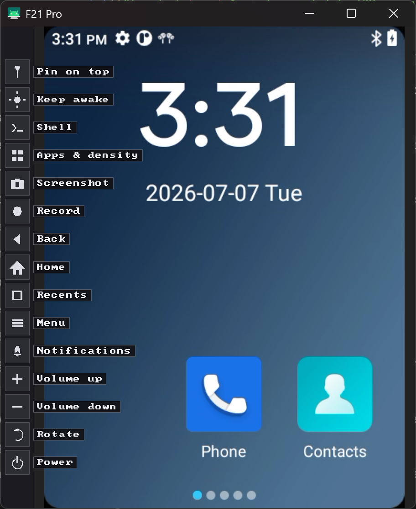
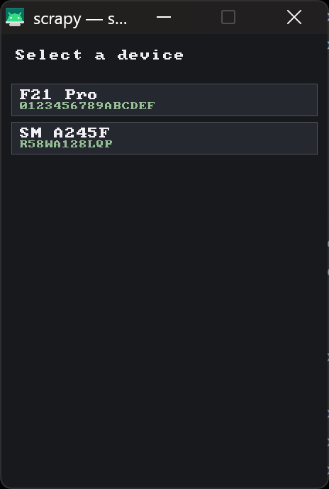

scrapy is my personal fix for the things that annoy me about scrcpy, including:

- Not working when two devices are connected (and having to reopen it on every disconnect)
- Opening unneeded console windows
- Needing to open a shell manually
- Having no easy way to press the home button or view notifications

...and a bunch of other features that I think come in handy.

I called it scrapy because imo saying screen copy every time is just too long...

So, in nicer terms:

scrapy is a fork of [scrcpy](https://github.com/Genymobile/scrcpy) that adds an on-screen control layer to the mirror window, so you can drive the device without memorizing keyboard shortcuts, as well as adding some nice features that are very usefull.

And here are some images for the curious:



When more than one device is connected, scrapy lets you pick which one to mirror (and it reconnects automatically instead of quitting when a device is unplugged):



You can also edit the config file that gets created after the first run to change some of the default settings and looks:

- `buttons` — which toolbar buttons to show, in order (or `none`)
- `shell_width`, `apps_width` — drawer widths
- `terminal_text_size` — terminal font size
- `capture_dir` — where screenshots and recordings are saved
- `pin_on_top` — start pinned always-on-top
- `default_density` — force a DPI on connect
- `key_*` — rebind any button's keyboard shortcut

## Building

Windows client (cross-compiled from Linux/WSL with mingw-w64):

```sh
./release/build_windows.sh 64
```

Based on the great [scrcpy](https://github.com/Genymobile/scrcpy) by Genymobile, licensed under Apache-2.0.